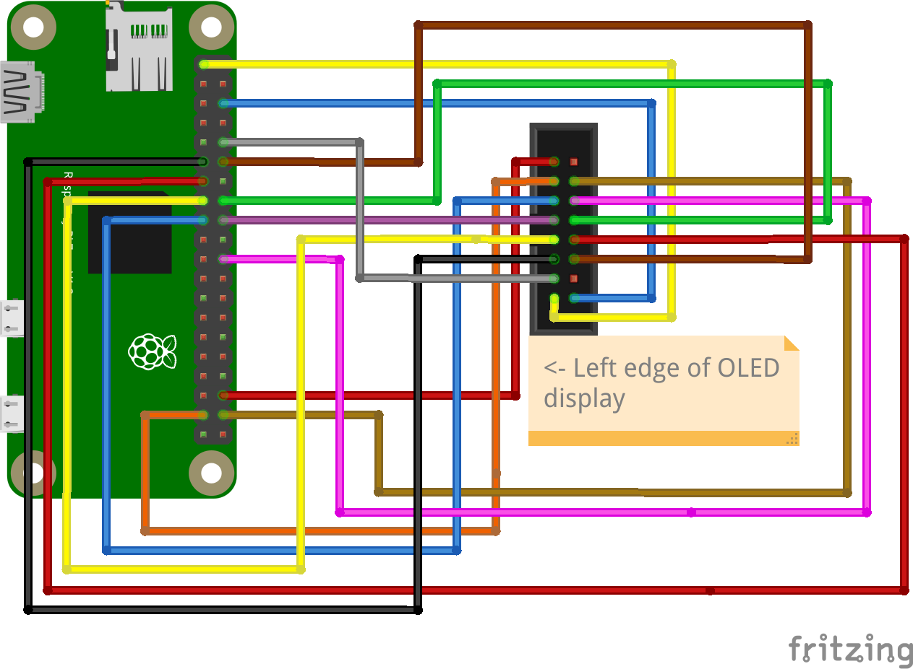

# Hardware

My main aim was to keep the process as simple as possible and since this is my first project of this kind, I tried to
avoid soldering.

## Components

1. Raspberry Pi Zero 2W, although this will probably work on any board.
2. OLED display. I got [this one](https://www.aliexpress.com/item/1005005985371717.html) in yellow, which I think
   matches the SL display colour pretty well. It uses an SSD1322 controller.
3. Power supply. Most phone chargers with a micro USB cable will work, but be sure to check it outputs enough power.

If you can't (or you don't want to) solder you can get the following headers and cables. This will set you back a few
kronor more, since Postnord will need to handle customs.

4. [GPIO Hammer Headers](https://shop.pimoroni.com/products/gpio-hammer-header) since the Pi Zero does not have
   headers installed.
5. [Cables](https://shop.pimoroni.com/products/jumper-jerky?variant=348491271) to connect the screen with the board.

## Connecting the components

By default, the screen is configured to use the 8080 protocol and soldering is needed to change it. The drawback of this
is that a lot of cables are required, compared to other protocols, which makes creating a case harder.

The table below shows the connections between the screen and the Pi. Be sure to consult the wiring diagram of your
screen to ensure that the pins correspond to the same functions.

| Screen Pin | Raspberry Pi Pin | Description | WiringPi Pin |
|------------|------------------|-------------|--------------|
| 1          | 6 (Ground)       | Ground      | -            |
| 2          | 1 (3.3V)         | Power       | -            |
| 4          | 10 (GPIO 15)     | Data 0      | 16           |
| 5          | 12 (GPIO 18)     | Data 1      | 1            |
| 6          | 11 (GPIO 17)     | Data 2      | 0            |
| 7          | 13 (GPIO 27)     | Data 3      | 2            |
| 8          | 15 (GPIO 22)     | Data 4      | 3            |
| 9          | 16 (GPIO 23)     | Data 5      | 4            |
| 10         | 18 (GPIO 24)     | Data 6      | 5            |
| 11         | 22 (GPIO 25)     | Data 7      | 6            |
| 12         | 17 (3.3V)        | RD#         | -            |            
| 13         | 38 (GPIO 20)     | R/W#        | 28           |
| 14         | 37 (GPIO 26)     | D/C#        | 25           |            
| 16         | 36 (GPIO 16)     | CS#         | 27           |     

WiringPi is the C library used for communication between the Pi and the screen and uses its own numbering scheme.

A messy schematic is also shown below:

